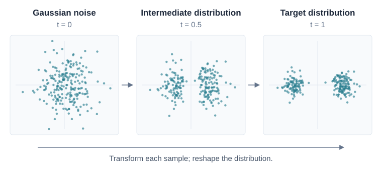

I still remember when I studied machine learning during undergrad, one of the first things I was taught was how to use linear regression to predict house prices. At that time, the ability to predict something seemed enough and was already attractive. But I believe many people, including me, wondered: is ML all about predicting? Could it be creative enough to generate something from scratch? Now more than a decade has passed, and we are literally living in an era of "generation," something I could never have imagined back when I was an undergrad. We talk to chatbots, we see photorealistic images and even cinematic videos generated by AI, we use coding agents, and we even see AI being used to design new proteins.

As a witness to this tremendous revolution, on one hand I find myself deeply fascinated by generative models, not only because they are widely applicable, but also because of their elegance. On the other hand, I am curious about what the next era of AI will look like, and I do believe generative models will play an important role in it. Therefore, I decided to write something down. This might end up becoming a series, ranging from the technologies behind generative models to random thoughts on the future of GenAI.

I came up with this idea while studying the [MIT Flow Matching and Diffusion Models](https://diffusion.csail.mit.edu/2026/index.html) and [Stanford CS336: Language Modeling from Scratch](https://cs336.stanford.edu/) courses. This series can also be taken as my notes on them, as I think being able to explain something is a useful way to strengthen one's understanding. Borrowing an analogy from AI: maybe I should try generating an explanation of my own to see how much I have learned, lol.

## Generative Models

Broadly speaking, there are many kinds of generative models, from image generators like Stable Diffusion to text generators like LLMs. They share the goal of learning from existing data to generate new examples, but the methods often differ. One reason is that the data they are trying to model is different.

Images are usually modeled as continuous values, while text is typically represented as a sequence of discrete tokens. For example, averaging the pixel values of two images produces a blended image. Averaging two token IDs does not produce a meaningful word halfway between them. This difference influences how we build models, although it does not create a strict boundary between the methods we can use.

Starting with **image generation** sounds like a good idea, it also gives us a foundation for discussing video, where a model must capture both individual frames and how they change over time. Later, we can talk about text generation too.

### A Brief History

Image generation is not new; it has a long history. A few milestones in deep generative modeling help put the names in context:

- **Variational autoencoders (VAEs, 2013)** learn a latent representation and a decoder. Generation starts by sampling a latent variable from a prior distribution, then decoding it into data. See [Auto-Encoding Variational Bayes](https://arxiv.org/abs/1312.6114).
- **Generative adversarial networks (GANs, 2014)** train a generator alongside a discriminator that tries to distinguish generated examples from real ones. See [Generative Adversarial Networks](https://arxiv.org/abs/1406.2661).
- **Diffusion models**, with a major milestone in [Denoising Diffusion Probabilistic Models (2020)](https://arxiv.org/abs/2006.11239), learn to generate through a sequence of denoising steps.
- **Flow matching (2022)** offers a way to train continuous flow models, which transform a simple distribution into a data distribution by moving samples along a learned velocity field. See [Flow Matching for Generative Modeling](https://arxiv.org/abs/2210.02747).

This is only a short list, and these ideas often build on one another. Still, it creates a familiar difficulty for people like me: every few years, there is another set of ideas to catch up with. It helps to first understand the problem they are all trying to solve.

### Representation

Since the generation happens inside a computer, we first need to represent the data in a way computer can understand. For an RGB image with height $H$ and width $W$, we can flatten its pixel values into a vector

$$
x \in \mathbb{R}^{d}, \qquad d = H \times W \times 3.
$$

A $256 \times 256$ image is therefore a single point in a space with $196{,}608$ dimensions.

Image files typically store discrete pixel values, such as integers from $0$ to $255$. For modeling, we often normalize them to a range such as $[0,1]$ by dividing by $255$, then treat them as continuous variables. Normalization itself only rescales the values; treating them as continuous is a modeling approximation. Some models instead work in a compressed latent space, but pixel space is enough for our discussion.

### Distribution

We often hear the term **data distribution**, but what exactly is it? Imagine taking many photos of cats. Some show orange cats, some show black cats; the poses, backgrounds, and lighting vary too. The data distribution describes how likely different kinds of images are within the population we want to model.

We use $p_{\mathrm{data}}$ to denote the data distribution and $p_{\mathrm{data}}(x)$ for its probability density at an image vector $x$. In practice, we do not know an analytical expression for this density. What we have is a dataset of examples from the distribution:

$$
\mathcal{D} = \{x^{(1)}, x^{(2)}, \ldots, x^{(N)}\},
\qquad x^{(i)} \sim p_{\mathrm{data}}.
$$

**This finite dataset is only a snapshot of the underlying distribution**. We hope to learn enough of its structure to generate plausible images beyond the ones we happened to collect.

### Generation

So far, we have a numerical representation and a dataset from a distribution we want to learn. Generation means producing new samples with the same kinds of patterns and variation. A model that always produces the same convincing cat would miss most of that variation. We care about both the quality of individual images and the distribution of images the model produces.

But **how** do we generate samples from a distribution whose formula we do not know?

## Generation As Sampling

This is where learning comes in. We use the dataset to train a model that generates samples from a learned distribution $p_\theta$, which approximates $p_{\mathrm{data}}$. After training, generation means sampling from the model:

$$
x_{\mathrm{new}} \sim p_\theta,
\qquad p_\theta \approx p_{\mathrm{data}}.
$$

That approximation matters: we sample from the model we trained, and how well it matches the real data depends on the data, model, and training procedure.

We also do not necessarily need a neural network that directly outputs a probability density. A model can instead learn a procedure that transforms samples from a simple distribution into samples resembling the data. This is the perspective we will take for flow matching and diffusion models.

People sometimes describe generation as interpolation on a data manifold. This can be useful intuition, but it is not a general definition of generation. Averaging two training images will usually produce a blurry blend. What we want is a sampling procedure that captures the structure and variety of the data.

## Flow Matching and Diffusion Models

Flow matching and diffusion models are state-of-the-art image generation models, they share an appealing idea: start with a distribution we can easily sample from, such as Gaussian noise, and gradually transform it into something that resembles the data distribution. A neural network learns how to guide this transformation. After training, we can start from fresh noise and use the learned process to generate new samples.

*A toy transformation from a Gaussian noise distribution ($t = 0$) to a target distribution ($t = 1$). Each dot represents one sample. This is a mathematical illustration, not the output of a trained model.*

At a high level, **diffusion models** learn to reverse a process that gradually adds noise to data, while **flow matching** learns a velocity field that moves samples from noise toward data. The two are closely related, and we will explore their training methods and connections in later posts. For now, the main idea is that **generation becomes a gradual transformation from random noise into images**.

## Conditional Generation

So far, everything we have discussed is **unconditional generation**, which is like freestyle generation without a specific request. In reality, people may want an image that follows a description such as "a cat with orange and white fur." In robotics, we might want to generate a possible future observation conditioned on the current observation and a proposed action.

The basic idea stays the same. We introduce a condition $y$ and learn a conditional distribution:

$$
p_\theta(x \mid y) \approx p_{\mathrm{data}}(x \mid y),
\qquad x_{\mathrm{new}} \sim p_\theta(\cdot \mid y).
$$

For a text-to-image model, $x$ is an image and $y$ is its text prompt. The same prompt can still produce many different images because it leaves details such as pose and background unspecified.

To make this work, the model needs to learn the relationship between the condition and the output, for example from image-caption pairs. We will leave the details of how to incorporate that condition for a later post.

## Summary

We started with images as vectors of numbers, then viewed those images as samples from an unknown data distribution. A generative model learns from a finite dataset to produce new samples from an approximation of that distribution. Flow matching and diffusion models approach this by connecting noise and data through an evolving distribution, while conditional generation lets us specify what kind of sample we want.

I find this perspective quite elegant. What looks like creating an image from scratch becomes a concrete problem: **learn a sampling procedure**. The next question is how to train that procedure using only examples. That is where we will go next, starting with probability paths, velocity fields, and the flow matching objective.
